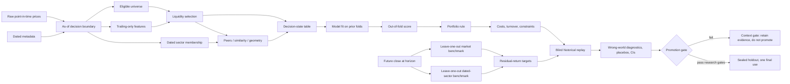

# Stock Research Dependency and Failure Architecture v1

## Purpose

This project is an as-of decision system, not merely a prediction notebook. A value can be numerically correct and still be invalid if it belongs to the wrong date, security, universe, sector, peer set, or model version. Every experiment must therefore preserve information ownership and must be replayable from a frozen decision boundary.

## Dependency architecture

## Information ownership

| Object | Historical owner | Earliest valid use | Failure if ownership is wrong |
|---|---|---|---|
| Close and volume | ticker, market date | after that market observation | future price leakage |
| Universe membership | ticker, effective interval | inside the effective interval | survivorship bias |
| Sector membership | ticker, effective interval | inside the effective interval | current-sector look-ahead |
| Trailing feature | ticker, decision date, feature version | after all source observations exist | mixed-time feature |
| Similarity edge or coordinate | decision date, fitted feature window, graph version | after fitting only on prior/current information | full-sample geometry leakage |
| Future-return label | ticker, decision date, evaluation date, horizon | evaluation only | target leakage |
| Model score | ticker, decision date, model/fold version | after training on prior folds | in-sample optimism |
| Trading cost | decision date, portfolio transition, cost version | portfolio replay | unrealistic execution |

## Wrong worlds that must be tested

1. **Future-adjusted owner:** a split-adjusted or revised value was unavailable at the simulated decision time.
2. **Survivor owner:** the current ticker list is treated as if it existed throughout history.
3. **Current-sector owner:** today's sector assignment is backfilled into earlier dates.
4. **Full-sample geometry:** scaling, coordinates, clusters, or similarity edges are fitted using future rows.
5. **Market-as-stock:** broad market movement is credited to stock-selection skill.
6. **Self-benchmark:** a ticker contributes to the benchmark used to neutralize its own return.
7. **Overlapping-label certainty:** overlapping horizons are treated as independent observations.
8. **Execution mismatch:** a prediction made with one price convention is replayed with another.

Each wrong world is a falsification target. A promising model should weaken or fail when its causal ingredient is destroyed, and should not improve merely because ownership constraints were relaxed.

## Frozen residual target

For ticker (i), decision date (t), and horizon (h):

[
r_{i,t,h} = \frac{P_{i,t+h}}{P_{i,t}} - 1
]

The leave-one-out market benchmark is:

[
r^{mkt,-i}_{t,h} =
\frac{\sum_j r_{j,t,h} - r_{i,t,h}}{N_t - 1}
]

The market residual is:

[
e^{mkt}_{i,t,h} = r_{i,t,h} - r^{mkt,-i}_{t,h}
]

When a dated point-in-time sector mapping exists and the sector has enough peers, the same leave-one-out construction is used inside the sector:

[
e^{sector}_{i,t,h} = r_{i,t,h} - r^{sector,-i}_{t,h}
]

The primary target uses the sector residual only where dated membership is valid and peer coverage passes the frozen threshold. It otherwise falls back to the market residual. A current static sector map must never be presented as historical point-in-time metadata.

## Promotion sequence

1. Validate source span, duplicates, missingness, and ownership fields.
2. Freeze the feature, target, split, portfolio, and cost definitions.
3. Build targets with decision and evaluation dates strictly before the sealed holdout.
4. Fit only on expanding or rolling prior folds.
5. Report raw return and residual-return performance separately.
6. Run placebos, wrong-world tests, confidence intervals, turnover, and cost sensitivity.
7. Promote only when the frozen research gates pass.
8. Open the sealed holdout once, only for a genuinely promoted candidate.

## Known limitation

The current `ResearchPrices` table provides a large point-in-time price panel, but historical universe membership, ticker delistings, and dated sector classifications have not yet been independently verified. This stage can improve temporal coverage and neutralize common market movement, but it must not be described as fully survivorship-safe until those ownership tables exist.
